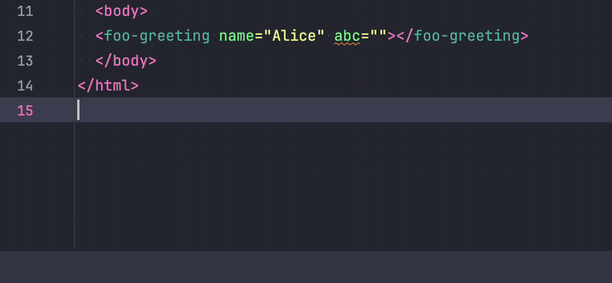

# Lit & Vite & TS & web-types

This is a dummy app based on `lit-ts`, with web-types generation added.

## How to set up custom element autocompletion in Webstorm

Webstorm depends on a [`web-types.json`](https://github.com/JetBrains/web-types) file that needs to be provided by the component library to provide autocomplete and documentation.

1. Add `"web-types": "./web-types.json"` to the library's `package.json`
2. Install [jpradelle/web-component-analyzer](https://github.com/jpradelle/web-component-analyzer/)
3. Add script `"webtypes": "wca-webtypes analyze src --format webtypes --outFile web-types.json"` to the library's `package.json`
4. Configure the build process to run the `webtypes` command every time a component changes, e.g. by using [vite-plugin-watch](https://www.npmjs.com/package/vite-plugin-watch)
    ```js
    import { defineConfig } from "vite"
    import { watch } from "vite-plugin-watch"
    
    export default defineConfig({
      plugins: [
        watch({
          pattern: "src/components/**/*.ts",
          command: "npm run webtypes",
        }),
      ],
    })
    ```
5. Also [add JSdoc to your components](https://github.com/runem/web-component-analyzer?tab=readme-ov-file#-how-to-document-your-components-using-jsdoc) for nicer autocomplete
    ```js
    /**
    * @element foo-greeting
    *
    * @attr {string} name - The name of the person you'd like say hello to
    * */
    ```

### GIF of autocomplete working


